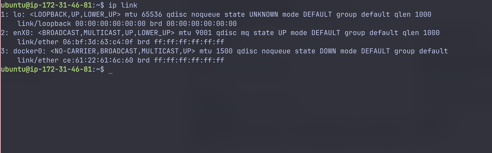
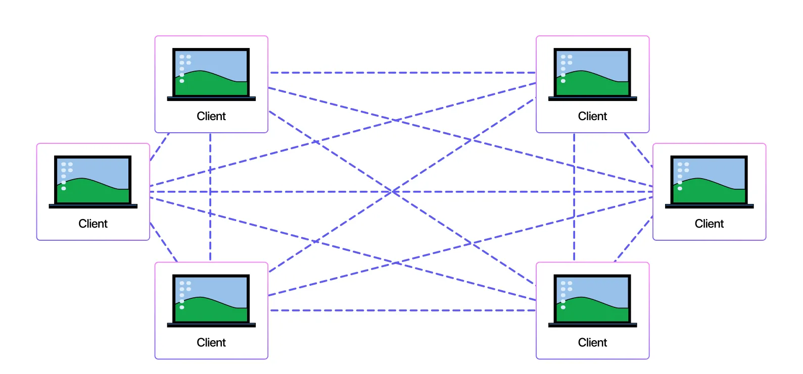

---
date:
  created: 2025-09-28 
  updated: 2025-09-28
readtime: 15
categories:
  - Technical
tags:
  - networking
  - devops
  - cloud
  - docker
  - containers
  - linux-namespaces
  - iptables
  - container-networking
  - hands-on
  - tutorial
authors:
  - anthony

---

# Peeking Under the Hood: Docker Networking with Namespaces

Hey folks 👋

This is the very first time I've actually sat down and invested some serious time into writing a blog post like this. Usually, when exploring technical concepts, I just hack around with things, test them on an EC2 instance, convince myself I understand everything (spoiler: I don't), and then move on—only to forget it all the next day. But this time, I wanted to share the journey with you.

The topic? **Docker Networking**—something I realized I knew embarrassingly little about.

Why tackle this? Because the deeper I dug into container networking (after a humbling moment of realizing my ignorance), the more fascinating it became:

- Docker isn't "just magic"—containers are simply the elegant abstraction Docker presents to us
- Containers are not *some kind of lightweight VMs*. Of course, that is the reason why they use it so much 🙂 But tbh, I dont think so much people could deeply understand it
- And the networking behind a simple `docker run -dp ...` is way more interesting than you’d think.
- And, the last thing, this blog article could be a note for me. By sharing it, I would remember it better, hope so…

So, if you've ever been curious about:

- What *actually* is a container? (1) How your host takes care of the isolation for multiple containers, and for container and host machine itself.
- How does Docker set up networking for your app? (2)

…then you're in the right place. 🚀

1. Containers are processes with namespaces providing isolation - not lightweight VMs!
2. Docker uses Linux network namespaces, bridges, and iptables rules behind the scenes

!!! warning "⚠️ Lab Environment Required"

    This article includes hands-on exercises that modify network configurations. I strongly recommend using an isolated VM for the lab (I personally use EC2).

    While this is a lightweight lab, please be careful with network modifications on your main system! 🙂

    

---

## What This Blog is About

So, let's dive into what this article will teach you.

To truly understand what's happening behind the scenes—how all these components work together to create your running container—there's quite a bit to unpack.

I plan to split this into 2 articles: this first one focuses on network namespaces, then I'll connect what we learn to Docker's implementation. After that, we'll explore Minikube networking.

This first episode is all about **network namespaces**. I considered cramming everything into one massive post, but let's keep it digestible.

My goal is to walk you through Linux Network Namespaces—the fundamental building blocks of Docker networking.

We’ll get our hands dirty by running commands directly on an **EC2 instance** and building up a mental model of how isolation, bridges, and NAT fit together.

Along the way, we’ll connect the dots to what Docker itself does under the hood when you spin up a container.

Think of it as: *“Let’s manually re-create what Docker is secretly doing for us.”*

---

## Why Namespaces?

Namespaces are the foundational building blocks of containers. A network namespace is one type of namespace in Linux.

When you run a container with `docker run ...`, Docker is essentially telling the kernel:

- "Hey kernel, please give me a new isolated view of the world (a namespace)."
- That namespace can be for processes, mounts, users… or in our case: **networking** (which is our focus today)
- Inside this isolated world, your process believes it has its own network interface, IP address, and routing table.

But of course, under the hood, it’s still sharing the same kernel as the host.

Docker uses this mechanism to give containers their own isolated world. From the host's perspective, we can view this in two ways: the **logical view** where containers are simply containers, and the **deeper reality** where containers are just processes with isolation established using **namespaces**.

---

## Hands-On Walkthrough on EC2

Here’s the fun part. Let’s build this up step by step.

### Prerequisites

- I use Mac, so some commands will not be familiar with you guys. To make it more convenient, I have provisioned an EC2 with Ubuntu AMI, hope that is fine for most viewers
- If you are using Linux distributions (Ubuntu, WSL…) and have Docker installed already then you are ready to go. If not, maybe provisioning an EC2 is a good idea.
- To install Docker, use this doc https://docs.docker.com/engine/install/
- Open the terminal, connect to your VM, and lets get started.

### 1. Understand the current setup

Networking can seem overwhelming at first, but at its core, it's just interfaces with IP/MAC addresses talking to each other. To understand how your computer/VM connects to the internet and internal networks, we just need to examine a few key components: interfaces, MAC addresses, routing tables, and iptables. Once you see these pieces, everything becomes clear.

Let's start by inspecting all network interfaces (both virtual and physical) on our machine.

Run `ip link` to check all network interfaces



This is my output (on an EC2 instance). You would see 3 interfaces:

- `lo`: loopback interface
- `enX0`: enX0 is your EC2’s Internet-facing NIC
- `docker0`: magic behind docker 😋 but ignore it for now

Here would be the diagram


For your machine, you might some other kinds of interfaces. But just ignore it for now.

Focus on the interface that acts like a bridge connecting your host to the outer world.

### 2. Create a Network Namespace

Let's dive into the interesting part—network namespaces!

Think of your instance as a house. A network namespace is like a room inside that house. As the homeowner, you can freely create, destroy, and connect these rooms however you want.

Let's create our first network namespace: 

```bash
sudo ip netns add ns1 # this will create a network namespace
```

Now we have a new isolated network namespace called `ns1`. If you run:

```bash
sudo ip netns list
```

You would see something like this.


OK, now we get ns1 - a network namespace created. Here is the logical view.


But, nothing changes. You will still see the same interfaces with the same IPs on host


But, when we peek inside the namespace, there will be some interesting things.

To run something inside the namespace, add this prefix `sudo ip netns exec <namespace-name>`. E.g

```bash
sudo ip netns exec ns1 ip a
```

You’ll notice it only has the loopback interface (in status DOWN). Nothing else. No Internet yet.


Our goal is to use this isolation, to create a small network system inside our host, and connect namespaces together using basic network components.

Create another namespace, name it `ns2`.

```bash
sudo ip netns add ns2
sudo ip netns list
```


Now we have this logical view.


---

### 3. Create a veth Pair

!!! goal "🎯 Our Goal"
    Execute inside namespace `ns1` and successfully ping namespace `ns2`

Now we will add some network components to connect ns1 and ns2 using veth pair.

A veth pair acts like a virtual ethernet cable with two ends. Let's create one on our host:

```bash
sudo ip link add veth1 type veth peer name veth2
```

Now we have a virtual network cable with two ends: `veth1` and `veth2`.


You can use `ip link` to check these new interfaces.


But those are separated cable, has no connection to our 2 namespaces yet. Now we will connect/attach the veth1 end to ns1, and veth2 end to ns2 so that a virtual connection could be established.

Run this command to attach those ends to their namespaces. Notice that after attaching, the host will no longer see those interfaces anymore.

```bash
sudo ip link set veth1 netns ns1
sudo ip link set veth2 netns ns2
```


But if you exec into the namespace, like ns1, an new interface appears 😋


You have successfully connected those namespaces. Here is what we got:


### 4.  Add IP addresses to those cable ends, and ping

The connection is established. Now we will add IPs to those ends

Run

```bash
sudo ip netns exec ns1 ip addr add 10.0.0.1/24 dev veth1
sudo ip netns exec ns2 ip addr add 10.0.0.2/24 dev veth2
```

Now we have assigned IPs to veth1 and veth2. Can we ping now? No, those interfaces are still DOWN. Bring them up.

```bash
sudo ip netns exec ns1 ip link set veth1 up
sudo ip netns exec ns2 ip link set veth2 up
```

Now we can ping from ns1 to ns2, and vice versa

```bash
sudo ip netns exec ns1 ping 10.0.0.2 -c 5
sudo ip netns exec ns2 ping 10.0.0.1 -c 5
```


Network connected. Now this is what we have now


---

### 5. Introduce the bridge interface

Now, you feel something of network namespaces. But I got to tell you: they dont use this in Docker.

!!! danger "🚫 Why Not Direct veth Pairs?"

    Imagine you have 10 containers in the same network. Using direct veth pairs would create a messy mesh topology:

    - **P2P connections needed**: 10 × (10 - 1) = **90 connections** (1)
    - **Management nightmare**: Adding/removing containers affects multiple connections
    - **Resource waste**: Each connection consumes kernel resources

    1. The formula for full mesh connectivity: n × (n-1) where n is the number of nodes



Not ideal, right? And that is when bridge network comes into the game 😋 It creates a hub-and-spoke topology, enables the network connection but still keeps things simple.

Lets see how it is done

Delete all things we have provisioned :) yes, just delete them, we will provision a better system later

Run

```bash
sudo ip netns exec ns1 ip link del veth1
```

When we delete veth1 which is an end of the cable, veth2 is deleted too

You should not see anything other than lo interface in 2 namespaces


Now lets start creating the bridge network. To create one, we must create a virtual switch; then create 2 cables connecting each namespace to a port on the switch. That ensures they can communicate as now they are on the same network

```bash
sudo ip link add br0 type bridge # set the type to BRIDGE
sudo ip link set br0 up
```

Run `ip link` , you will see an interface br0 of type bridge


You got this


Now its time to create virtual cables: create a pair cables

- The `veth1` - `veth1-br`: one end attached to ns1, one end attached to br0 (the switch)
- The `veth2` - `veth2-br`: one end attached to ns2, one end attached to br0 (the switch)

```bash
sudo ip link add veth1 type veth peer name veth1-br
sudo ip link set veth1 netns ns1
sudo ip link add veth2 type veth peer name veth2-br
sudo ip link set veth2 netns ns2

# Attach "bridge ends" to br0
sudo ip link set veth1-br master br0
sudo ip link set veth2-br master br0
sudo ip link set veth1-br up
sudo ip link set veth2-br up

```

Check with `ip link`  command


You would see veth1-br and veth2-br on the host, in the UP status

Inside each namespace, veth1 and veth2 are still DOWN


Bring them up

```bash
sudo ip netns exec ns1 ip link set veth1 up
sudo ip netns exec ns2 ip link set veth2 up
```

!!! question "🤔 Quick Question"
    Can we ping between the 2 namespaces now?

    === "Think about it..."
        What's missing for successful communication?

    === "Answer"
        **No!** We haven't assigned any IP addresses yet. Layer 2 connectivity exists, but we need Layer 3 (IP) addresses for ping to work.

Let's assign IP addresses:

```bash
sudo ip netns exec ns1 ip addr add 10.0.0.1/24 dev veth1
sudo ip netns exec ns2 ip addr add 10.0.0.2/24 dev veth2
```


Now, can we ping? Yes, the connection is established successfully now 😋

Try yourself 😋


The logical view now


!!! question "❓ Why no IPs on bridge cable ends?"

    You might wonder why we don't need to assign IP addresses to the bridge cable ends:

    - The **bridge itself** operates at **Layer 2 (Ethernet)** (1)
    - It doesn't need an IP to forward packets — it just switches frames based on MAC addresses
    - Each **veth end** connected to `br0` is like a port on a physical switch

    1. Layer 2 devices work with MAC addresses, not IP addresses

Now, we already have a small network inside our host using Linux network namespaces. And this is exactly the way Docker sets up our containers.

But, another question: from inside the container, can we reach other network? Like the Internet. Because we can do it from inside our container, right?

Lets configure it!

---

### 6. Connect your namespace network to the outer world

Easily to recognize that: we have to use enX0 as a gateway to the internet

enX0 is on the host. And the only way to connect to enX0 is via br0. Add br0 an IP address. This will be the address of the bridge interface. 

- This makes the host behave like another machine on the same subnet.
- Now the host has `10.0.0.254` and namespaces are `10.0.0.1`, `10.0.0.2`

```bash
sudo ip addr add 10.0.0.254/24 dev br0
```

Now, from the host, can we ping 10.0.0.1 (inside namespace 1)? Yes, try to ping 10.0.0.1/24

```bash
ping 10.0.0.1 -c 4
```


Why? Check the route table with `ip route show`


This line “10.0.0.0/24 dev br0 proto kernel scope link src 10.0.0.254” means: traffic to any IP in 10.0.0.0/24 should go to br0 interface.

Side quest: From inside the namespace, try to ping 10.0.0.254. 


Now, from within the namespace, we must be able to ping enX0. Because it is now the only way to the internet.

The packet flow: veth1 → br0 → enX0. But br0 and enX0 are on the same host. To let the packet flow from one interface to another interface, we must enable it explicitly.

```bash
# Allow forwarding in the host
sysctl -w net.ipv4.ip_forward=1
```


Now, try to ping enX0 IP address from within the namespace (get IP by ip a)


Why do we get **network is unreachable** here. Because from the namespace view, 172.31.46.81 is not in their network, it is an IP address from the outer world. We have not added any route table rule into the namespace so that the namespace does not know where to route the packet to.


This shows only the default route. Since 172.31.46.81 doesn't match any known routes, the packet gets dropped.

We need to add a default route to guide packets: "For any destination outside our local network, send it via the bridge (br0) at 10.0.0.254."

```bash
sudo ip netns exec ns1 ip route add default via 10.0.0.254
sudo ip netns exec ns2 ip route add default via 10.0.0.254
```

Now, we can ping enX0 IP from the namespace.


Cool, your namespace network is now connected to enX0. But still cannot reach the internet 😋 

---

### 4. Internet connection for the namespace network - iptables rules

You can try to ping 8.8.8.8 (the google dns service) from within your namespace, and it will not work 😟


Why?

Because the packet coming out of your host, to go to the Internet, still has the `src` as the namespace internal IP, which is 10.0.0.1/24 or 10.0.0.2/24 (you can tell me that, this is not right, there maybe some upstream NAT configured for EC2; yes, but keep it simple for other viewers, I will just explain it in a very high level pov)

This is the private address, so the 8.8.8.8 host cannot know where to return it, so no connection can be established. We must MASQUERADE the IP src address via iptables rule

```bash
iptables -t nat -A POSTROUTING -s 10.0.0.0/24 -o enX0 -j MASQUERADE
```

This rule rewrites the packet’s **source IP** to the IP of the outgoing interface (`enX0`) for all packets from 10.0.0.0/24, **after the kernel has decided the output interface**, just before the packet leaves.

Now, hope it works 🙂 But NO.


There is something strange around here. Hmmmm…..

Checked all iptable rules to find the root cause. It is because of the default DROP in the FORWARDING table. Run this to fix.

```bash
# Lets namespace traffic leave the host via enX0.
sudo iptables -I FORWARD 1 -i br0 -o enX0 -j ACCEPT

# Lets return traffic from the Internet back into the namespaces, but only if the namespace initiated it.
sudo iptables -I FORWARD 1 -i enX0 -o br0 -m state --state RELATED,ESTABLISHED -j ACCEPT
```

It is getting quite complex now 😟 Please drop a comment if you are stuck at this point. The iptables will be in another article.

But now, your namespace can connect to 8.8.8.8. Perfect 😋


The whole picture


---

## How This Relates to Docker

I have stated that: Docker uses namespaces to create those “containers” for you. And indeed it is. You can delete all of these setup, and investigate by yourself what docker is doing under the hood. Here are some hints 😋

### Interface docker0

You will notice that there is an interface when installing Docker, the `docker0`


It is actually the bridge interface create by docker. In our case, it acts like our br0.

So, when you run:

```bash
docker run -dp 8080:80 nginx
```

Docker is essentially automating all of the above:

- Creates a namespace for the container.
- Creates a veth pair.
- Connects it to the default bridge (`docker0`).
- Assigns an IP.
- Sets up iptables rules for NAT + port mapping (can be preset when installing)

That’s why your container can:

- Talk to other containers.
- Reach the Internet.
- Be reached from the host at specific ports.

It’s literally this same setup, just automated.

---

### Docker’s iptables Rules

If you peek at `iptables -t nat -L -n -v`, you’ll see Docker’s fingerprints:

- **POSTROUTING MASQUERADE**: Same as our manual rule, so containers reach the Internet.
- **DOCKER chain**: Handles DNAT for published ports (e.g., 8080 → container:80).

So the packet flow looks like this:

1. Packet leaves container with source IP in the namespace (like 10.0.0.1).
2. Hits the bridge → forwarded to host.
3. NAT changes source to host IP.
4. Packet goes out via `eth0` (or `enX0`).
5. Response comes back, NAT reverses translation, packet is delivered to the container.

That’s the entire magic trick. 🪄

!!! info "🐳 Docker Connection Summary"

    Now that we've manually built the networking foundation, you can see that Docker simply **automates** all these steps:

    ```bash
    docker run -dp 8080:80 nginx
    ```

    This single command does:

    - ✅ Creates network namespace
    - ✅ Creates veth pair
    - ✅ Connects to bridge (docker0)
    - ✅ Assigns IP address
    - ✅ Sets up iptables/NAT rules
    - ✅ Configures port mapping

    **Questions?** Drop them in the comments! 😋

---

## Coming Up Next

This is just **Part 1** of the story.

In the next episode, we’ll zoom out a bit and look at **Minikube networking** (and maybe, do some review on Docker networking)

Why Minikube? Because it’s the tool many of us use to test Kubernetes locally, and it has its *own* clever tricks for networking that are worth exploring, especially when running with docker driver.

So stay tuned - things are just getting started 😉

---

Thanks for reading, and if you have questions, ping me - I’d love to hear your take on how you first learned Docker networking.
